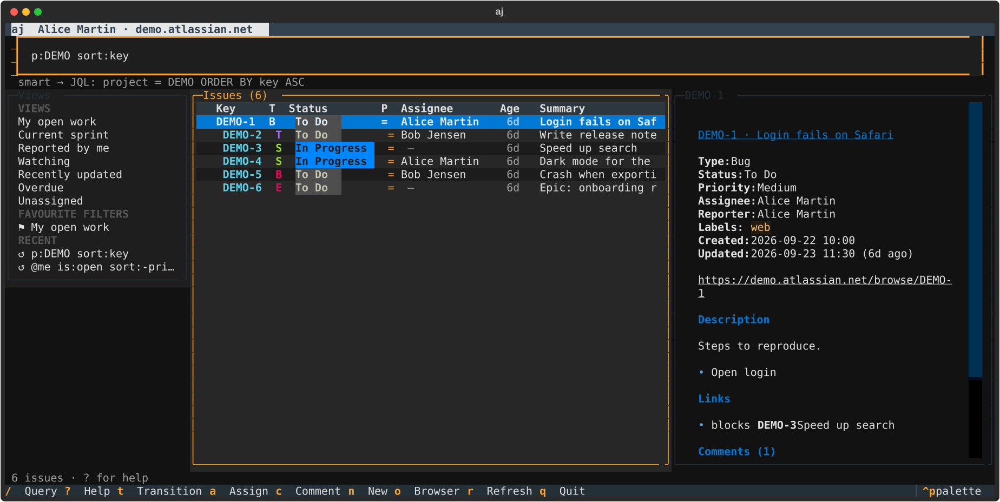
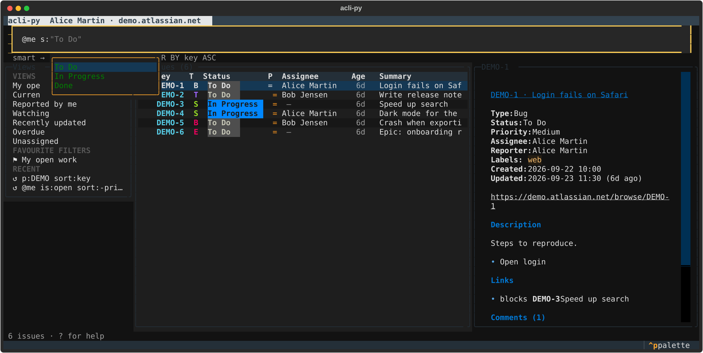

# Interactive: the TUI, the shell and smart queries

`aj` has two interactive ways in, and both understand the same query language.

- `aj tui` is a full-screen issue browser: search as you type, read an issue beside the list,
  and change it without leaving.
- `aj shell` is a prompt for every `aj` command. It completes commands, options and your
  site's own values.

## The TUI

```sh
aj tui                                  # your open work
aj tui '@me is:open sort:-priority'     # start from a query
aj tui --view "Current sprint"          # or from a view
aj -n tui                               # a dry run: try everything, nothing is sent
```



The top line is the query bar. Under it, `aj` shows the JQL it will run, or what is wrong with
the query, which Jira itself checks before anything runs. On the left are the built-in views,
your saved views, your favourite filters and your recent queries. In the middle is the issue
list, which loads more as you scroll. On the right is the highlighted issue: its details,
description, subtasks, links and latest comments.



Press `/` to edit the query. Completions follow the cursor. They offer fields, operators and
values in JQL, and filters and values in a smart query, and the values come from your site:
its statuses, projects, people, labels and custom fields. `Tab` takes the highlighted
completion, `↑`/`↓` move through them, and `→` accepts the grey suggestion at the end of the
line. `Enter` runs the query.

| Key | Does |
|---|---|
| `/` | Edit the query |
| `j` `k` `g` `G` | Down, up, first, last |
| `Enter` | Read the issue (scroll its details) |
| `Space` | Mark an issue. `t` `a` `A` `c` `l` `p` then act on every marked one |
| `t` | Transition. With several issues marked, only statuses all of them can reach are offered |
| `a` / `A` | Assign to someone (type to search) / to me |
| `c` | Comment, in Markdown |
| `e` / `d` | Edit the summary / the description |
| `l` | Labels: `web -legacy` adds `web` and removes `legacy` |
| `p` | Priority |
| `w` | Watch or unwatch |
| `n` | New issue |
| `S` | Sort by…, which rewrites the query's `sort:` (or `ORDER BY`) |
| `s` | Save the query as a view |
| `o` / `y` / `Y` | Open in the browser / copy the key / copy the link |
| `r` | Refresh |
| `L` | The activity log: every request, how long it took, and what a dry run planned |
| `Ctrl+P` | The command palette: every action and view by name |
| `?` | Help, including the smart query syntax |

Views are saved in `views.json` next to your config (`aj config path`). The TUI and the shell
share the query history.

## Smart queries

Smart queries are short and forgiving, and they compile to JQL. They work in the TUI, the
shell, and `aj issue search`:

```sh
aj issue search '@me is:open #web sort:-priority'
aj issue search 'p:DEMO s:progress updated:7d "login fails"'
aj issue search '-#legacy t:bug,story is:sprint'
aj issue search --syntax              # every term
```

| Term | Meaning |
|---|---|
| `@me`, `@bob`, `@none` | Assignee (a name, email, `me` or `none`) |
| `#web` | Label |
| `!high` | Priority |
| `p:DEMO` `s:"In Progress"` `t:bug` `c:api` `v:2.4` | Project, status, type, component, fix version |
| `r:@me` `w:@me` | Reporter, watcher |
| `sprint:current` `sprint:42` `parent:DEMO-1` | Sprint (current, future, closed, id or name), parent |
| `created:7d` `updated:>30d` `due:3d` `resolved:week` | Dates: within 7 days, older than 30 days, due within 3 days… |
| `created:2026-09-01..2026-09-30` | A date range |
| `is:open` `is:done` `is:mine` `is:unassigned` `is:overdue` `is:sprint` `is:backlog` `is:recent` `is:watching` | Common questions |
| `sort:-priority,key` | Order (`-` for descending) |
| `DEMO-12` | That issue |
| `-TERM` | Not: `-#legacy`, `-s:done`, `-@me` |
| other words, `"a phrase"` | Full-text search |

Terms combine with AND. The same filter given twice means either, so `s:todo s:review` is
`status in (…)`. Values are matched to your site's own spelling before Jira sees them:
`s:progress` becomes `"In Progress"`, `s:todo` becomes `"To Do"`, and `@bob` becomes Bob's
account id. When a name could mean several people, `aj` asks you to be more precise
instead of guessing.

A negation keeps issues where the field is empty. In plain JQL, `labels != legacy` silently
drops every issue that has no labels at all. `-#legacy` compiles to
`(labels != legacy OR labels is EMPTY)`, which is what you meant.

Anything containing `=`, `~`, `in (` or `ORDER BY` is sent as JQL unchanged. Pass `--raw` to
`aj issue search` to never treat the query as a smart query.

## The shell

```console
$ aj shell
aj shell: type a command without 'aj'. Tab completes; 'help' lists commands.
aj> issue transition DEMO-1 --to <Tab>
                                 In Progress
                                 Done
aj> issue search 'status = Done AND assignee = cur<Tab>
aj> dry-run on
aj (dry run)> issue edit --jql 'labels = old' --remove-label old -y
```

Completion walks the real command tree, so it knows every command, option and choice. Values
come from your site: issue keys (`DEMO-` then Tab), projects, statuses, issue types,
priorities, labels and people. Inside a quoted query after `issue search` or `--jql`, it
completes JQL and smart queries. The grey suggestion after the cursor comes from your history.

| Command | Does |
|---|---|
| any `aj` command | Runs it, with or without the leading `aj` |
| `help [COMMAND]` | Help for everything, or for one command |
| `dry-run on` / `off` | Make every following command a dry run (or stop) |
| `tui [QUERY]` | Open the TUI; you come back to the shell when you quit |
| `clear` / `exit` | Clear the screen / leave (or `Ctrl+D`) |

The history is kept in `shell-history` next to your config. Lines containing an API token
(`--token …`) are never written to it.

## How it works

The TUI and the shell send their reads and writes through a small application layer built on
[mediary](https://pypi.org/project/mediary/), a CQRS mediator. Reads are queries, such as
`SearchIssues`, `GetIssue` and `GetTransitions`. Changes are commands, such as
`TransitionIssue`, `AssignIssue` and `CommentOnIssue`. Behaviours wrap every message:

- **Activity:** counts what is in flight (the `⟳` at the top) and keeps the activity log.
- **Query cache:** answers the same query from memory for a minute, so moving through the
  list stays instant.
- **Announce:** after a command, empties the cache and publishes an `IssueChanged` event. The
  TUI listens for it and refreshes that row and the detail pane.

Handlers are plain functions over the same HTTP client the command line uses, and mediary runs
them on worker threads, so the UI never waits on the network. The client enforces dry runs
here exactly as it does for the command line.
